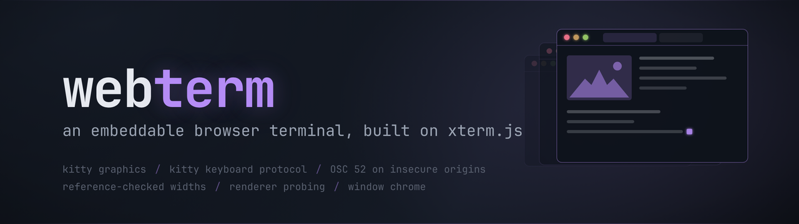
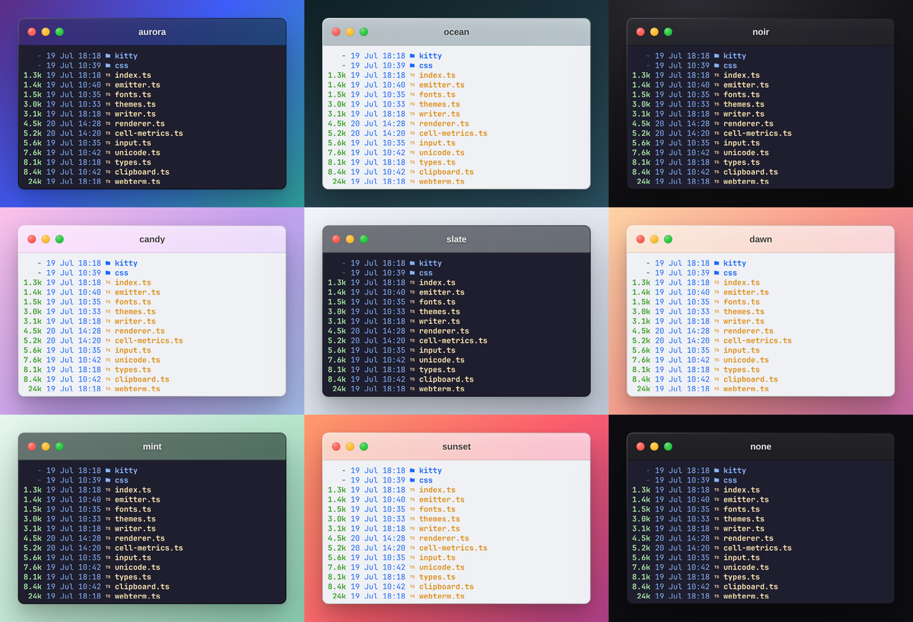
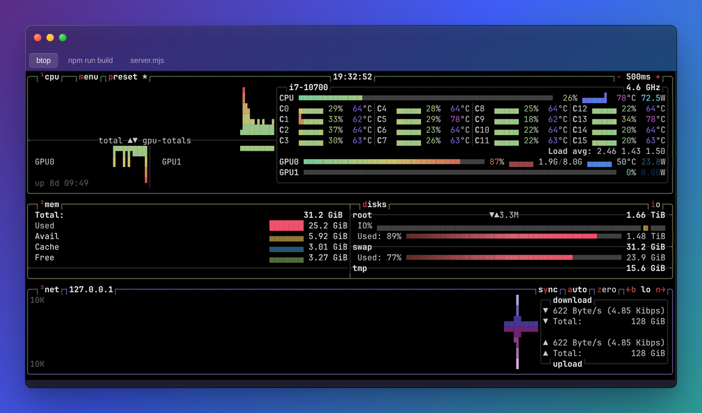
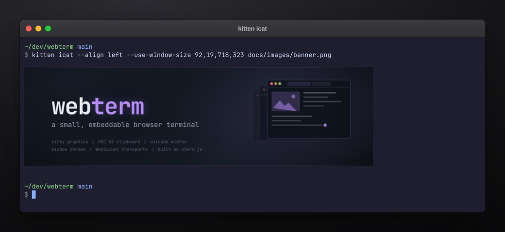
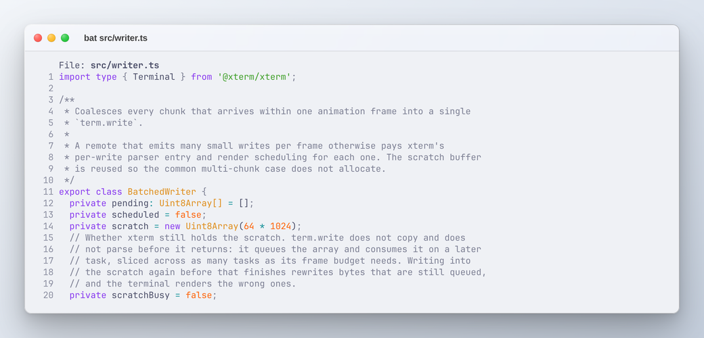
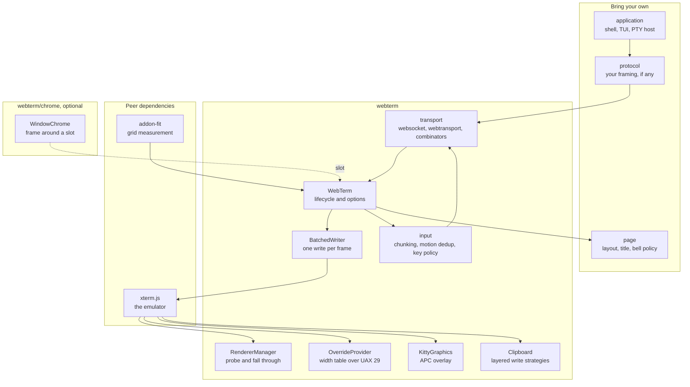
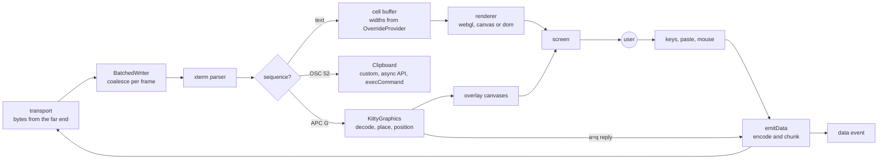

<p align="center">
  
</p>

# webterm

A small, embeddable browser terminal built on xterm.js.

You bring the emulator and the bytes. `@xterm/xterm` and `@xterm/addon-fit` are the only two peer dependencies, so a project that already depends on xterm does not get a second copy of it, and the bytes come from whatever PTY, SSH bridge or WebSocket server you already run. What this package gives back is the layer between the two: kitty graphics, a clipboard that works on an insecure origin, unicode widths checked against a reference VT, renderer probing, write batching, input chunking and the rest of the details that every project ends up writing again. It has zero runtime dependencies. Five further xterm addons (webgl, canvas, unicode-graphemes, image, web-links) are dynamically imported, and only when the options ask for them, so the ESM entry point is 30.7 KB gzipped and nothing else is fetched by default.

It is built to be taken apart. Transports are a three-method interface the package never looks inside; the clipboard write path, the unicode width table and the renderer choice are each one option; the underlying `Terminal` is public as `term.xterm`; and the window chrome is a separate entry point that imports nothing from the terminal, so a page that wants a frame around a code block does not download an emulator to get one.

## What it looks like

Every image below is the built package in a real browser: the terminals are real `WebTerm` instances, the text in them is the output of a real program on a real pty, and the inline picture is what `kitten icat` actually transmitted. Regenerate them with `node scripts/capture/capture.mjs` after a build.

<table>
  <tr>
    <td colspan="2"></td>
  </tr>
  <tr>
    <td colspan="2" align="center"><sub>the nine background presets, light and dark frames alternating, a real terminal in each</sub></td>
  </tr>
  <tr>
    <td></td>
    <td></td>
  </tr>
  <tr>
    <td align="center"><sub>btop on the alternate screen, with tabs and traffic lights</sub></td>
    <td align="center"><sub>kitten icat, transmitted in stream mode after webterm answered its capability probe</sub></td>
  </tr>
  <tr>
    <td colspan="2"></td>
  </tr>
  <tr>
    <td colspan="2" align="center"><sub>light appearance, left-aligned title, no tabs</sub></td>
  </tr>
</table>

## What it does

- Renders the kitty graphics protocol as absolutely positioned DOM canvases in a layer above the grid, rather than baking placements into the cell buffer as `@xterm/addon-image` does, so a placement can be moved, refreshed and deleted individually.
- Implements the kitty actions `a=t`, `a=T`, `a=p`, `a=d` and `a=q`; direct base64 transmission (`t=d`); formats 24 (RGB), 32 (RGBA) and 100 (PNG, decoded through `createImageBitmap`); zlib payloads (`o=z`) through `DecompressionStream`; chunked transmission (`m=1`); and deletion by image id or placement id.
- Answers `a=q` capability probes, `OK` for direct transmission and `ENOTSUPPORTED` for the temp-file and shared-memory media, which is what lets `kitten icat` settle on stream mode instead of waiting out its detection timeout.
- Repositions every placement on scroll, resize and font change, and anchors it either to the buffer row that introduced it (`scrollback`, the default) or to the visible grid (`viewport`, for a compositor that re-emits its placements each frame).
- Moves the cursor past a placement as the protocol requires, right by its columns and down by its rows unless the sender asks for `C=1`, so the cells an image covers are consumed in the buffer rather than only painted over. `kitten icat` emits nothing but a trailing CR LF of its own and relies on the terminal for the rest.
- Implements the kitty keyboard protocol, which xterm.js does not: full CSI u reporting with progressive enhancement, so an application can finally tell Ctrl+I from Tab, Ctrl+M from Enter and Esc from the start of an escape sequence, and can see key release, key repeat, the shifted and base-layout alternates, and the text a key produced.
- Keeps every private xterm.js reach in one file, `src/kitty/xterm-adapter.ts`, with the degradation for each written down, so an xterm release that renames an internal is one file to read rather than a search. The keyboard protocol needs none of them and uses only published API.
- Answers the geometry and capability queries an application sends before it decides what to emit: `CSI 14 t`, `CSI 16 t` and `CSI 18 t` for the text area and cell box, DECRQSS for the cursor style, and XTGETTCAP for the terminal name. See [Terminal reports](#terminal-reports).
- Handles OSC 52 clipboard writes, which xterm.js registers no handler for, and decodes the payload as UTF-8 rather than as the Latin-1 string `atob` hands back.
- Falls back to a hidden textarea and `document.execCommand('copy')` where `navigator.clipboard` is absent, which is every non-secure context: a LAN IP, an http reverse proxy, any deployment without TLS that is not localhost.
- Retries a clipboard write refused for want of a user gesture on the next `pointerdown` or `keydown`, once, and reports `written: false` when every strategy was refused rather than failing silently.
- Installs `@xterm/addon-unicode-graphemes` for UAX 29 segmentation and layers a per-codepoint width override on top of it. The shipped map has one entry, U+200B to zero width, because a zero-width space that eats a column visibly breaks alignment in ordinary text.
- Checks those widths against a 45-case corpus measured from ghostty-vt with mode 2027 clustering enabled, of which 39 agree and 6 diverge in documented, degenerate cases.
- Probes for a real WebGL context on a throwaway canvas before loading `@xterm/addon-webgl`, since a blocklisted driver exposes the constructor and still refuses the context, and falls through webgl, canvas and dom, including on a context loss after startup.
- Coalesces every chunk written inside one animation frame into a single `term.write`, reusing a 64 KB scratch buffer so the multi-chunk case does not allocate.
- Chunks outbound input at 65536 bytes by default, so a large paste does not arrive at a server that caps a single message as one oversized frame.
- Drops SGR mouse motion reports that repeat the last cell and button, which a busy TUI generates a great many of.
- Loads `FontFace` entries and awaits `document.fonts.ready` before constructing the `Terminal`, because xterm measures the cell box once and caches whichever face has resolved by then.
- Sets `lineHeight` to 1 and `cursorBlink` to false by default: the font's own line box already includes its line gap, and a blinking cursor repaints an otherwise idle terminal forever.
- Takes `navigator.keyboard.lock` for Ctrl+W, Ctrl+T, Ctrl+N, Ctrl+R, Ctrl+L, Tab and Escape, which only has an effect while the document is fullscreen, because that is the only state the API is ever granted in.
- Ships WebSocket and WebTransport transports plus `fallback()` and `reconnecting()` combinators, the WebTransport one framing a QUIC byte stream with a 4-byte big-endian length prefix by default.
- Emits `resize`, `title`, `bell`, `selection`, `clipboard` and `renderer` as events rather than acting on them, so the page decides what a title change or a bell means.
- Ships an optional macOS-style window chrome (`webterm/chrome`) with traffic lights, tabs, layered shadows and eight decorative background presets, in a separate bundle that imports nothing from the terminal.

## Design goals

- Embeddable. The package is a class and a container element. It renders no UI of its own, injects nothing into the document on import, and needs exactly one class name (`.webterm`) on the element you hand it.
- Unopinionated. There is no framing, no protocol, no reconnect policy and no session model baked in. Bytes go in, bytes come out, and everything the terminal wants to tell the page arrives as an event.
- Correct. The defaults that differ from convention (`lineHeight: 1`, `cursorBlink: false`, `osc52Read: false`, fonts awaited before construction) are each the result of a specific failure, and each one is documented where it is set.
- Separable. The chrome, the transports, the kitty overlay, the clipboard, the unicode provider and the width table are separate modules with separate entry points, and each is usable or replaceable without the others.
- Honest. The README and [docs/limits.md](docs/limits.md) state what is unimplemented, what depends on a prerelease of a peer dependency, what a reference emulator disagrees with, and which private fields the overlay reaches into.

## Architecture



The dashed edge is the only relationship between the chrome and the terminal, and it runs one way: `createWindowChrome()` hands back an empty `content` element, `WebTerm.open()` is given it, and neither module imports the other. That is why they are separate bundles.

Everything in the core subgraph is reachable on its own. `Clipboard`, `OverrideProvider`, `KittyGraphics`, `MotionFilter`, `chunkBytes` and the kitty protocol parser are all named exports, and the unit suites exercise several of them without a browser at all.

`Transport` is three methods (`start`, `send`, `close`) and a `TransportSink` of two (`data`, `closed`). There is deliberately no framing in that interface: a consumer with an existing protocol strips their own headers in `start` and adds them in `send`, and the package never learns anything about message shapes, length prefixes or keepalives.

## How bytes move



Two things about the outbound half are worth stating, because they are the parts a consumer usually gets wrong. `emitData` is the single outbound path: keystrokes, pastes and kitty capability replies all go through it, all get chunked at `input.chunkBytes`, and all reach both the `data` listeners and an attached transport. A consumer who wires a socket by hand and one who calls `attach()` therefore see exactly the same bytes. And `input.readOnly` gates that path rather than the renderer, so a read-only terminal keeps painting output and answers no probes.

Mouse reports take a parallel route through xterm's `onBinary` and the `binary` event, because they are byte values rather than text; the motion filter sits there, and drops an SGR report whose cell and button match the previous one.

## Quick start

This package is not published to npm yet. Note that the unscoped name `webterm`
on the registry belongs to an unrelated project, so `npm install webterm` and
any `unpkg.com/webterm` URL will fetch someone else's code, not this. The
package is named `@gaurav-gosain/webterm`. Build it from a checkout:

```bash
git clone https://github.com/Gaurav-Gosain/webterm
cd webterm
npm install
npm run build   # dist/: ESM entry points, both standalone bundles, the CSS
```

That produces everything the examples below import. To consume it from another
project, either point at the checkout (`npm install /path/to/webterm`) or pack
it (`npm pack`) and install the resulting tarball; the peer dependencies
(`@xterm/xterm`, `@xterm/addon-fit`) are yours to install either way.

### A plain HTML page

The standalone build inlines xterm.js and every addon, so this is one script tag with no build step and nothing fetched at runtime. Copy `dist/webterm.standalone.global.js` and `dist/webterm.css` next to the file below, add `@xterm/xterm/css/xterm.css` from your own install, and open it.

```html
<!doctype html>
<html>
  <head>
    <link rel="stylesheet" href="./xterm.css" />
    <link rel="stylesheet" href="./webterm.css" />
    <style>
      html, body { margin: 0; height: 100%; background: #1e1e2e; }
      #terminal { width: 100vw; height: 100vh; }
    </style>
  </head>
  <body>
    <div id="terminal" class="webterm"></div>
    <script src="./webterm.standalone.global.js"></script>
    <script>
      // Renamed on the way out: a top-level `const WebTerm` in a classic
      // script would collide with the global of the same name.
      const { WebTerm: WebTermClass } = window.WebTerm;
      const term = new WebTermClass({ fontSize: 14, theme: 'catppuccin-mocha' });

      term.open(document.getElementById('terminal')).then(() => {
        term.write('hello\r\n$ ');
        // Nothing is attached, so input arrives here and goes nowhere else.
        term.on('data', (bytes) => {
          const text = new TextDecoder().decode(bytes);
          term.write(text === '\r' ? '\r\n$ ' : text);
        });
        term.focus();
      });
    </script>
  </body>
</html>
```

`.webterm` on the container is the only class the package needs, and the container needs a size, since the grid is fitted to whatever it is. The stylesheet is small (592 bytes gzipped) and covers the container, the scrollbar and the graphics overlay; `@xterm/xterm/css/xterm.css` is still required and is your import, because you may already have it.

### From a bundler

```bash
npm install /path/to/webterm @xterm/xterm @xterm/addon-fit
```

The import specifier is still `webterm`, because that is the package name in
`package.json`; only where it is installed from differs.

```ts
import { WebTerm } from '@gaurav-gosain/webterm';
import { webSocketTransport } from '@gaurav-gosain/webterm/transport';
import '@xterm/xterm/css/xterm.css';
import 'webterm/css';

const term = await new WebTerm({ fontSize: 14 }).open(document.body);
term.attach(webSocketTransport('wss://example.com/pty'));

term.on('resize', ({ cols, rows, pixel }) => sendWinsize(cols, rows, pixel));
term.on('title', (title) => (document.title = title));
```

`open()` is asynchronous because the font load has to finish before `new Terminal`, and idempotent: a second call resolves to the same instance rather than opening a second terminal into the container. Resize, title, bell and clipboard arrive as events rather than as side effects, so the page decides what they mean. Nothing is sent anywhere until `attach()`, which returns a detach function as well as leaving `detach()` available.

With your own protocol, implement `Transport` instead:

```ts
term.attach({
  start(sink) {
    socket.onmessage = (event) => {
      const frame = new Uint8Array(event.data);
      // Strip whatever header your server puts on the front.
      if (frame[0] === MSG_OUTPUT) sink.data(frame.subarray(1));
    };
    socket.onclose = () => sink.closed();
  },
  send(bytes) {
    const frame = new Uint8Array(bytes.length + 1);
    frame[0] = MSG_INPUT;
    frame.set(bytes, 1);
    socket.send(frame);
  },
  close() {
    socket.close();
  },
});
```

A rejection from `start` means the attach failed, which is what `fallback()` acts on. Wrap a transport in `reconnecting()` for exponential backoff (1000 ms, factor 1.5, capped at 30 s, five attempts by default), which rebuilds the transport through the factory each time rather than reusing a closed one:

```ts
import { fallback, reconnecting, webSocketTransport, webTransportTransport } from '@gaurav-gosain/webterm/transport';

term.attach(
  reconnecting(() =>
    fallback(
      webTransportTransport('https://example.com:4433/wt'),
      webSocketTransport('wss://example.com/ws'),
    ),
  ),
);
```

`fallback` falls through even when the first transport was explicitly chosen. `typeof WebTransport !== 'undefined'` is not a capability check: Chromium refuses a QUIC connection to a loopback origin with a self-signed certificate hash where Firefox accepts it, so wiring `webTransportTransport` alone ships something that works on your machine and not on your users'.

### With the window chrome

```ts
import { createWindowChrome } from '@gaurav-gosain/webterm/chrome';
import 'webterm/chrome.css';

const chrome = createWindowChrome({
  title: 'zsh',
  background: 'ocean',
  contentBackground: '#1e1e2e',
  contentPadding: 10,
});
chrome.mount(document.getElementById('demo'));

const term = await new WebTerm({ theme: 'catppuccin-mocha' }).open(chrome.content);
```

The frame is a slot: it hands back an empty element and the terminal opens into it. `chrome.content.innerHTML = '<pre>anything at all</pre>'` works just as well, and the chrome bundle is 3.8 KB gzipped because it contains no emulator.

## API

### `new WebTerm(options?)`

Nothing happens until `open`. The constructor only records the options.

### `open(container: HTMLElement): Promise<this>`

Loads the fonts, constructs the `Terminal`, installs the providers and addons and attaches to `container`.

### Methods

| Signature | Notes |
| --- | --- |
| `dispose(): void` | Tears down every listener, observer and addon, removes the overlay and empties the container |
| `fit(): void` | Refits the grid to the container now, ignoring the debounce |
| `resize(cols, rows): void` | Sets the grid explicitly and turns automatic fitting off for the rest of the instance's life |
| `focus(): void` / `blur(): void` | |
| `clear(): void` / `reset(): void` | `reset` also drops every kitty placement and the motion filter state |
| `write(data: Uint8Array \| string): void` | Bytes from the far end. A `Uint8Array` is batched to one write per animation frame; a string is passed straight through |
| `flush(): Promise<void>` | Resolves once the emulator has consumed everything written |
| `input(data: string): void` | Injects input as if typed, so it leaves through `data` and the transport |
| `paste(text: string): void` | Goes through the paste path, bracketed when the application asked |
| `attach(transport: Transport): () => void` | Replaces any current transport. Returns a detach function |
| `detach(): void` | |
| `setOptions(options: Partial<WebTermOptions>): void` | Applies live. Groups are replaced, not merged |
| `setTheme(theme: ITheme \| ThemeName): void` | |
| `on(event, listener): () => void` | Returns an unsubscribe; `off(event, listener)` also exists |

### Getters

| Getter | Type | Notes |
| --- | --- | --- |
| `cols` / `rows` | `number` | Zero before `open` |
| `pixelSize` | `{ width, height }` | Rendered grid in CSS pixels, for a winsize report |
| `renderer` | `'webgl' \| 'canvas' \| 'dom'` | The one actually running, after probing and any fallback |
| `element` | `HTMLElement \| undefined` | xterm's element |
| `xterm` | `Terminal` | The underlying xterm instance. Throws before `open` |
| `kitty` | `KittyGraphics \| undefined` | The overlay, when enabled and supported |
| `keyboard` | `KittyKeyboard \| undefined` | The keyboard protocol, when enabled. `.flags` reports what the application turned on |
| `image` | `ImageAddon \| undefined` | The image addon, when `graphics.sixel` loaded it |

### Events

```ts
term.on('data', (bytes: Uint8Array) => void);       // input, UTF-8, already chunked
term.on('binary', (bytes: Uint8Array) => void);     // mouse reports, after motion dedup
term.on('resize', ({ cols, rows, pixel }) => void);
term.on('title', (title: string) => void);
term.on('bell', () => void);
term.on('selection', (text: string) => void);
term.on('clipboard', ({ text, written }) => void);  // written is false if every strategy was refused
term.on('renderer', (kind: RendererKind) => void);  // including a context-loss fallback
```

A listener that throws is caught and logged, so one bad handler does not stop the others or the emitting path.

### Options

Top level: `fontFamily`, `fontSize`, `fonts`, `lineHeight`, `theme`, `cursorBlink`, `cursorStyle`, `scrollback`, `cols`, `rows`, `fit`, `links`.

| Group | Keys and defaults |
| --- | --- |
| `renderer` | `prefer` (`'auto'`), `fallbackOnContextLoss` (`true`) |
| `clipboard` | `osc52` (`true`), `osc52Read` (`false`), `copyOnSelect` (`false`), `write` |
| `unicode` | `provider` (`'graphemes'`), `overrides` (`{ 0x200b: 0 }`) |
| `graphics` | `kitty` (`true`), `sixel` (`false`) |
| `keyboard` | `kitty` (`true`), `captureReservedKeys` (`true`), `reservedKeys`, `onKeyEvent` |
| `mouse` | `suppressContextMenu` (`true`), `dedupeMotion` (`true`) |
| `input` | `chunkBytes` (`65536`), `readOnly` (`false`) |
| `reports` | `terminalName` (`'xterm-256color'`), answered to XTGETTCAP `TN` |

Plus two escape hatches: `xterm`, a raw `ITerminalOptions` merged last so it wins over everything the wrapper decided, and `onTerminalCreated(term)`, called with the `Terminal` after construction and before `open`.

Every option carries its reasoning on the type, so an editor shows it without opening this file. Four defaults are deliberate rather than conventional:

- `lineHeight` is `1`. The font's own line box already includes its line gap, so anything else renders glyph ink taller than the cell and leaves a background-coloured seam between stacked block glyphs. Three tests in `test/browser/metrics.spec.mjs` sample those seams.
- `cursorBlink` is `false`. A blinking cursor repaints an otherwise idle terminal forever.
- `osc52Read` is `false` and should stay false. Answering a read request echoes the user's system clipboard back to whatever is running on the far end.
- `fonts` exists because a CSS `@font-face` races the measurement: xterm measures the cell box once and caches whichever face has resolved by then.

Four themes ship by name: `catppuccin-mocha` (the default), `catppuccin-latte`, `gruvbox-dark` and `nord`. Any `ITheme` can be passed instead; the named set is a convenience, not a constraint. A further 345 are available from a separate entry point, described below.

`term.xterm` is public on purpose. No wrapper anticipates everything, and a consumer who needs `term.parser`, `term.registerMarker` or a third-party addon should not have to fork the package to get it.

## Themes

The four named themes cover the five-minute path. Anything that lets a user pick a colour scheme wants a corpus instead, so one ships at `@gaurav-gosain/webterm/themes`: 345 schemes, 296 dark and 49 light, from [iTerm2-Color-Schemes](https://github.com/mbadolato/iTerm2-Color-Schemes) by way of the flattened JSON build that [vhs](https://github.com/charmbracelet/vhs) publishes.

```ts
import { getTheme, listThemes } from '@gaurav-gosain/webterm/themes';

const term = await new WebTerm({ theme: getTheme('tokyo-night') }).open(el);

for (const { id, name, appearance } of listThemes()) {
  // id for the value, name for the label, appearance to group light from dark
}
```

| Export | |
| --- | --- |
| `themeCorpus: Record<ThemeId, ThemeEntry>` | The whole corpus, keyed by id |
| `getTheme(id): ITheme \| undefined` | The palette alone, ready for `theme` or `setTheme` |
| `getThemeEntry(id): ThemeEntry \| undefined` | Palette, display name and appearance |
| `listThemes(): readonly ThemeMetadata[]` | `{ id, name, appearance }` per scheme, sorted by id, built once and cached |
| `ThemeId` | A union of every id, so an editor completes it and a typo does not compile |
| `ThemeAppearance`, `ThemeEntry`, `ThemeMetadata` | |

An unknown id returns `undefined` rather than throwing or falling back, because a picker restoring a scheme from an old config needs to know the difference. Ids read from a config file or a URL are accepted as plain strings, and an id of `constructor` or `toString` misses like any other.

It is a separate entry point because it is 228 KB, 38.1 KB gzipped, against 104 KB for the terminal itself. A consumer who never imports it never downloads it, and the corpus adds nothing at all to `dist/index.js`, which builds byte for byte the same with it present and absent. Nothing in the main entry reaches for it, so nothing pulls it in by accident.

Light and dark are computed rather than taken on trust. The background is gamma-decoded out of sRGB into a WCAG relative luminance and cut at 0.18, which is mid grey in linear light. Names are no guide: `Bright Lights`, `Thayer Bright` and `Tomorrow Night Bright` are all dark, `Tokyo Night Light` and `Night Owlish Light` are light. The upstream records do carry their own dark flag, and the computed classification agrees with all 345 of them, but it is hand-maintained metadata that a new scheme can arrive without, as thirteen of them arrive with no cursor colour.

The corpus is generated by `scripts/themes/generate.mjs` and committed, so install and build never touch the network. `scripts/themes/README.md` covers the id scheme, the duplicate handling and the mapping onto `ITheme`.

## Kitty graphics

`@xterm/addon-image` covers sixel and iTerm inline images, and it has kitty support, but it stores images against cells in the buffer through their extended attributes, and its own source records the consequences: it tracks one storage entry per kitty image id, so multiple placements of the same image overwrite each other, and it does not distinguish a lowercase delete selector from an uppercase one, so both free the image data. This overlay renders each placement as an absolutely positioned canvas in a DOM layer above the grid instead, keyed by the `(image id, placement id)` pair the protocol actually identifies a placement with, so it can be repositioned, refreshed in place and deleted without discarding the image bytes.

Out of scope by design: animation (`a=f`, `a=a`, `a=c`) and file, temp-file and shared-memory transmission (a browser cannot read a path in the sender's filesystem).

Unicode placeholder placements (`U=1`), which is how `yazi` and `ratatui-image` draw, are supported. A virtual placement has no position of its own: the application writes a grid of `U+10EEEE` cells carrying the row, the column and the image id, and the terminal draws the image over exactly those cells. The overlay reads that grid back off the cell buffer rather than deriving a rectangle from the transmitted pixel size, because the sender sized its transmission against the cell box it was told over `CSI 16 t` and a browser's cell box is rarely the same one. Deriving it twice is what leaves a column of undrawn placeholder cells down the edge of an image. The placeholder character is also given a blank glyph through a bundled single-purpose font, so those cells are never drawn as text even when the image is missing, evicted or still in flight.

Kitty graphics is request and response for detection. A client emits `a=q` probes and refuses to transmit the image at all if nothing answers, so an overlay that renders placements but never replies makes `kitten icat` report that the terminal has no graphics support. Direct transmission is answered `OK`; the temp-file and shared-memory media are answered `ENOTSUPPORTED`, which is what lets a client settle on stream mode rather than waiting out its timeout. Quiet mode is honoured (`q=1` drops successes, `q=2` drops everything), replies take the same outbound path a keystroke does so they reach an attached transport, and a terminal with `input.readOnly` stays silent rather than writing into someone else's session.

```ts
new WebTerm({ graphics: { kitty: { anchor: 'scrollback', storageLimit: 128 } } });
```

`scrollback` is the default and anchors a placement to the buffer row that introduced it, so the image scrolls away with its text. That is what a shell running an image viewer expects, and it is the right choice for a full-screen application too: the alternate screen has no scrollback, so there the anchoring row and the screen row are the same row. `viewport` pins a placement to the visible grid instead, for an inline compositor on the main screen that re-emits every placement each frame and would otherwise park images in scrollback history with its own newlines. `storageLimit` caps the decoded bitmaps retained before the least recently used is evicted, and an image with a live placement is never a candidate.

Under `scrollback` a placement is held by an xterm marker rather than a plain row number, so it stays on its line as the scrollback fills and trims, and is dropped once that line is trimmed out of history. Placements belong to the screen they were made on: the alternate screen hides the main screen's images while it is up, and discards its own on the way out, as the protocol requires. `ESC[2J` and `ESC[3J` clear placements, while the partial erases (`0J`, `1J`) leave them alone.

### Cursor movement

After a placement the cursor moves right by the placement's columns and down by its rows, scrolling the screen at the bottom exactly as text does. `C=1` suppresses it, and a virtual (`U=1`) or relative (`P`) placement never moves the cursor. The rectangle comes from `c` and `r` when the sender gives them, from one of them plus the source aspect ratio when only one is given, and otherwise from the transmitted pixel dimensions measured against the current cell box, which is the case `kitten icat` exercises.

The movement is applied through xterm's input handler at the point in the stream where the placement was parsed, not queued with `term.write`. A write issued from inside a parser callback is appended to the write buffer and parsed after the remainder of the current chunk, and the bytes that follow an image, including icat's trailing CR LF and the next shell prompt, are in that same chunk.

## Kitty keyboard

Legacy terminal key encoding loses information. Ctrl+I and Tab are both `0x09`. Ctrl+M and Enter are both `0x0d`. Esc is `0x1b`, which is also the first byte of every escape sequence, so a program has to guess with a timeout. Most modifier combinations on most keys have no encoding at all, which is why Ctrl+Shift+key bindings do not work in a terminal. Key release is not reported, so nothing can implement hold-to-activate. xterm.js does not implement the protocol that fixes this, and that is why key handling in a browser terminal is lossy.

The [kitty keyboard protocol](https://sw.kovidgoyal.net/kitty/keyboard-protocol/) is implemented here in full, including progressive enhancement.

```
CSI ? u              query the flags in effect, answered CSI ? <flags> u
CSI > <flags> u      push the current flags and adopt these
CSI < <number> u     pop, defaulting to one entry
CSI = <flags> ; <mode> u    set without touching the stack (1 replace, 2 add, 3 remove)
```

| Flag | Value | Effect |
| --- | --- | --- |
| Disambiguate | `1` | Esc, Ctrl+key, Alt+key and the keypad report as CSI u |
| Report event types | `2` | Key repeat and key release, not only press |
| Report alternate keys | `4` | The shifted key and the base-layout key alongside the key |
| Report all keys | `8` | Every key as an escape code, including plain text |
| Report associated text | `16` | The text the key produced, as codepoints |

Enabling it in the options changes nothing on its own. The protocol is entirely application-driven: until a program pushes a non-zero flag set, every key is encoded exactly as it was before, byte for byte, by xterm. The encoder returns nothing for a key the flags do not claim, and xterm's own handling runs untouched, so there is no legacy encoding reimplemented here to drift out of agreement with the one xterm already gets right.

```
CSI > 1 u    then Ctrl+A sends    ESC [ 97 ; 5 u      rather than 0x01
             and Esc sends        ESC [ 27 u          rather than 0x1b
             while a plain 'a' is still 'a'

CSI > 8 u    then 'a' sends       ESC [ 97 u
             and Shift+A sends    ESC [ 57441 ; 2 u  ESC [ 97 ; 2 u

CSI > 12 u   then Shift+A sends   ESC [ 97 : 65 ; 2 u
CSI > 10 u   then releasing 'a' sends  ESC [ 97 ; 1 : 3 u
```

The two screens keep independent stacks, so a full-screen application that enables the protocol and is then suspended does not leave the shell it returns to in a mode the shell never asked for, and the alternate screen's state is discarded on the way out the same way its buffer is. The stack is bounded at 16 entries and drops from the bottom, so a program that pushes without popping cannot grow terminal memory without limit. Popping an empty stack lands on no enhancements rather than being ignored: a program confused about its own state is better off in the encoding every application can parse.

Three details a browser forces:

- **Caps lock is not shift.** A browser reports `key` as `'A'` for both, so the base key is recovered by lowercasing and the lock is reported through the modifier field instead. That is what lets an application tell a capital typed with caps lock from one typed with shift.
- **The base-layout key comes from the physical key**, `KeyboardEvent.code`, not from the character. Lowercasing recovers `a` from `A`, but nothing recovers `1` from `!`. A Dvorak user pressing the key labelled Q on a US keyboard sends a base-layout code of `q`, so a binding on a physical position keeps working across layouts.
- **Composition is never claimed.** `Dead`, `Process`, `Unidentified` and `Compose` pass straight through to xterm's composition helper, because the key that will eventually be produced is not known yet and swallowing the event breaks every non-Latin input method.

Adding to it is meant to be small. The key tables in `src/keyboard/keys.ts` are data and the encoder names no key at all, so teaching it a key is a table row. Each flag is one branch in `src/keyboard/encoder.ts`. The flag state, the tables and the encoding are pure and free of DOM and xterm, so they are unit-tested directly; the wiring is confined to `src/keyboard/keyboard.ts`, which touches only published xterm API.

xterm's `attachCustomKeyEventHandler` is a single slot rather than a list, and the protocol takes it. Pass `keyboard.onKeyEvent` to add a handler without displacing it; returning `false` from it stops the key reaching both the protocol and xterm.

```ts
new WebTerm({
  keyboard: {
    kitty: true,
    onKeyEvent: (event) => !(event.ctrlKey && event.key === 'F'),
  },
});
```

## Clipboard

Three things a browser will do to a clipboard write, and what the package does about each.

**There is no `navigator.clipboard` outside a secure context.** Not a refused promise; the API is absent altogether. A LAN IP, an http reverse proxy or any non-localhost deployment without TLS lands here. The fallback is a hidden textarea and `document.execCommand('copy')`, which is deprecated but still implemented everywhere and does not require a secure context. The textarea is removed and the previously focused element refocused whether or not the copy succeeded.

**A write can be refused for want of a user gesture.** The retry is bound to the next `pointerdown` or `keydown` and fires once, so a copy triggered by an application rather than by the user still lands as soon as the user does anything at all.

**A write can be refused outright.** The `clipboard` event reports `written: false` so the page can say so rather than failing silently.

OSC 52 is decoded as UTF-8, not Latin-1. `atob` yields one character per byte and those bytes are UTF-8, so treating the result as text mojibakes everything outside Latin-1. `clipboard.write` replaces the whole strategy, which is the seam for an Electron host or a test double.

`copyOnSelect` is off by default. When on, it covers both selections: the one xterm owns from a plain left-drag, and the native browser selection produced by Shift+drag while an application holds mouse tracking.

## Unicode widths

The provider is `@xterm/addon-unicode-graphemes` (UAX 29) with a per-codepoint override table layered on top. The override provider delegates every call to the addon's own provider, rewrites the packed property value for the codepoints in the map, and reuses the delegate's version string so it displaces the addon in xterm's registry without anything that reads `terminal.unicode.activeVersion` having to know it exists.

The shipped table has exactly one entry, `{ 0x200b: 0 }`. `src/unicode.ts` records, at length, the five things that are deliberately not overridden and why, so that nobody adds them later: U+00AD (dropped by `InputHandler.print()` before a provider is ever asked), Devanagari matra (a spacing-mark question a width table cannot reach), U+200C and U+FEFF (already zero inside real text), U+200D (zeroing it re-advances every emoji ZWJ sequence), and the Cf general category as a whole (too blunt). `unicode.overrides` takes any map you prefer, and `{}` turns the layer off.

The table was checked against ghostty-vt, driven with mode 2027 clustering enabled: 45 cases, 39 agreeing and 6 diverging. Those six are listed in [docs/limits.md](docs/limits.md) rather than papered over. ghostty-vt is not a dependency and must not become one; it was the oracle, and the numbers are what ship.

## Terminal reports

An application asks the terminal what it is before it decides what to send. Those queries are answered here, in `src/reports.ts`, entirely through published `term.parser` API: xterm's parser runs a handler registered after construction before its own, and a handler that returns false falls through to it, so a single sequence can be corrected without displacing anything else.

| Query | Reply | Where it comes from |
| --- | --- | --- |
| `CSI 14 t` | `CSI 4 ; height ; width t` | The text area in CSS pixels |
| `CSI 16 t` | `CSI 6 ; height ; width t` | One cell in CSS pixels |
| `CSI 18 t` | `CSI 8 ; rows ; cols t` | The grid in cells |
| `DCS $ q SP q ST` | `DCS 1 $ r Ps SP q ST` | The cursor style the application set |
| `DCS + q 544e ST` | `DCS 1 + r 544E=... ST` | `reports.terminalName` |

The three geometry reports are xterm.js's own implementation, switched on. xterm gates the whole of `CSI t` behind `options.windowOptions`, which defaults to everything off, because the same sequence family can raise, move, resize and retitle a window and it will not let a remote program do that unasked. The gate is applied to handlers registered from outside as well, so opening it is not merely the shortest way to answer these three, it is the only one. webterm opens exactly those three and nothing else: `CSI 1 t`, `CSI 3 ; x ; y t`, `CSI 9 t` and the title stack stay the no-ops they are by default, which a test asserts by writing each of them and requiring silence.

DECRQSS for the cursor style is a correction rather than an addition. xterm.js answers it from `options.cursorStyle` and `options.cursorBlink`, but `CSI Ps SP q` writes to `coreService.decPrivateModes` and never touches the options, so the reply describes the cursor the embedder configured instead of the one the application asked for and the one on screen. The application's DECSCUSR is tracked here and the reply is built from it, falling back to the options exactly as the renderer does when the application has set none. RIS and DECSTR clear it, as they clear the private mode it shadows. Every other DECRQSS setting falls through to xterm untouched.

XTGETTCAP has no implementation in xterm.js at all, so the request is parsed and discarded and the application waits out its timeout. `TN` and the colour count are answered; anything else is left unanswered rather than refused with `DCS 0 + r`, because a refusal is a claim that the terminal lacks the capability and what is true here is only that this layer does not know. An application that gets no answer reads its terminfo entry, which does. `reports.terminalName` defaults to `xterm-256color` and should be set to whatever the pty is started with, since a frontend does not get to choose TERM.

The OSC colour queries (`OSC 4 ; n ; ?`, `OSC 10 ; ?`, `OSC 11 ; ?`, `OSC 12 ; ?`) are answered by xterm.js itself, out of its theme service, and nothing is added here on purpose. The theme service is the live resolved palette: it tracks a theme set through `setTheme`, including one out of the corpus, and also a palette an application changes at runtime with an `OSC 4` set, which `options.theme` does not. A second handler reading the options would be a staler answer to the same question. `test/browser/reports.spec.mjs` asserts the replies against a corpus theme rather than trusting that.

## Window chrome

`webterm/chrome` is an optional macOS-style frame: rounded corners, a title bar with traffic lights, an optional title and tabs, a layered shadow, and a decorative background with padding behind it. It imports nothing from the terminal, so it works around any content and a consumer who does not want it never loads it.

Backgrounds ship as presets: `aurora` (the default), `candy`, `dawn`, `mint`, `noir`, `ocean`, `slate`, `sunset` and `none`. Each is a gradient rather than a flat colour, because a shadowed window over a flat field has nothing for its shadow to fall across. `background` also takes a plain CSS value or one of `{ preset }`, `{ color }`, `{ gradient }`, `{ image }`, `{ css }`. Shadows are five layers at `medium`, from a 1px contact shadow to a 72px diffuse one, because a single blur can only be one of the two things a real window's shadow does.

`appearance` defaults to `auto` and follows `prefers-color-scheme`; `light` or `dark` pins it. Every transition is gated behind `prefers-reduced-motion: no-preference`, which a test asserts by counting the computed transitions under a forced reduced-motion emulation.

The traffic lights are decorative by default and are hidden from the accessibility tree, because a control that is announced and then does nothing is worse than no control. `lights: { interactive: true }` makes them real buttons with labels, reveals the platform glyphs on hover, and emits `close`, `minimize` and `maximize`. The chrome acts on none of them: what closing means belongs to the consumer. Tabs behave the same way, and interactive tabs get `role="tablist"`, a roving tabindex and arrow, `Home` and `End` navigation.

Two geometry notes, both of which are the reason the DOM is shaped the way it is. Set `contentBackground` to the terminal's background colour: `fit()` rounds the grid down to whole cells, so a few pixels of the slot are left over on the right and bottom, and matching the colour is what keeps them from reading as a border. And `contentPadding` insets a slot nested one level inside the padded box on purpose, because `FitAddon` subtracts only the terminal element's own padding when it measures, never its parent's, so padding applied directly to the terminal's container produces a grid wider than the box it sits in.

The frame is CSS custom properties throughout, under `--webterm-chrome-*`, and nothing is injected into the document on import. `update()` rebuilds the chrome above the slot without recreating the slot, so a terminal living inside it survives an options change.

## Size

Build output, measured on the tree at hand with tsup 8 targeting es2022. The standalone bundles are minified; the ESM entry points are not. Gzip is the system `gzip` at its default level, which is what a plausible static host does.

| File | Raw | Gzip | What it is |
| --- | --- | --- | --- |
| `dist/index.js` | 103.7 KB | 30.7 KB | ESM core, xterm external |
| `dist/transport/index.js` | 6.4 KB | 1.9 KB | Both transports and the combinators |
| `dist/chrome/index.js` | 12.7 KB | 3.8 KB | The window chrome |
| `dist/themes/index.js` | 228.1 KB | 38.1 KB | The theme corpus, imported only if asked for |
| `dist/webterm.css` | 1.2 KB | 0.6 KB | Container, scrollbar, overlay |
| `dist/chrome.css` | 22.8 KB | 6.7 KB | The frame |
| `dist/webterm.standalone.global.js` | 861.5 KB | 234.6 KB | Everything, xterm and all five addons inlined |
| `dist/webterm-chrome.standalone.global.js` | 8.4 KB | 3.1 KB | The frame, for a script tag |

The standalone bundle is large because an IIFE cannot code-split, so every dynamic import is inlined, including `@xterm/addon-image` at 76 KB, which the default options never load. A bundler build does not pay that: the addons stay dynamic imports and only the ones the options ask for are fetched.

## Tests

```bash
npm install
npm run typecheck
npm run build
npm run test:unit      # node's test runner, no browser
npm run test:browser   # playwright against the system chromium
```

80 unit tests cover the kitty graphics protocol parser, the keyboard encoder and its mode stack, the clipboard strategy selection and OSC 52 codec, the unicode override provider and the chrome presets, none of which need a DOM. 148 browser tests cover the rest: the terminal lifecycle and transports, the kitty overlay end to end (including reading pixels back off the placed canvas), the keyboard protocol, the clipboard through both a real permission grant and a stubbed-out `navigator.clipboard`, the grapheme corpus, cell metrics and seams, and the chrome. All 228 pass on the tree this README documents.

Every key in the keyboard suite is pressed through Playwright's keyboard, which goes through the browser's own input pipeline and produces trusted events, and every mode is set by writing the control sequence into the terminal the way an application sets it. A synthetic `dispatchEvent` would prove the encoder runs; it would not prove the key reaches it, that xterm's own handling was suppressed, or that the character is not also delivered a second time through the keypress path. Assertions are literal byte sequences, so a regression shows up as a diff of bytes.

The browser tests start one process, a static file server for the fixtures, which Playwright owns and tears down. There is no application server, so a failed run leaves nothing behind. `WEBTERM_CHROMIUM` overrides the browser path. The chrome suite runs twice, at device pixel ratios 1 and 2, and writes preset screenshots to `test/screenshots/<project>/`; the frame is the one part of the package whose correctness is partly a question of where an edge lands on the device pixel grid, which is also why one of its tests samples the seams against a deliberately fractional container size.

Headless GL here is ANGLE over SwiftShader, so the suites assert what is on the canvas and how the grid is laid out, never a frame rate or an absolute timing.

## Demo and examples

`demo/` exercises everything on one page: the terminal, a fake shell, kitty graphics, every chrome background preset, theme switching and appearance. It is classic script tags and relative paths, so it opens off the filesystem with no server, after one build.

```bash
npm install && npm run build
xdg-open demo/index.html
```

`scripts/capture/capture.mjs` regenerates the images above, and `scripts/banner/` the header. Both drive `dist`, so neither can show a feature that only exists in `src`.

`examples/` has three, smallest first: [`script-tag/`](examples/script-tag) (no build step at all), [`bundler/`](examples/bundler) (ESM with types) and [`websocket-transport/`](examples/websocket-transport) (a real server, with the shipped transport, the fallback and reconnect combinators, and a hand-written transport for a protocol with its own framing).

## Extending

Every external thing the package touches sits behind one option or one small interface:

- Carry the bytes yourself: implement `Transport` (three methods, no framing assumed).
- Replace the clipboard write path: `clipboard.write` (one function).
- Change the width policy: `unicode.overrides` (a codepoint-to-width map, `{}` to turn the layer off).
- Pin or swap the renderer: `renderer.prefer` (one of `auto`, `webgl`, `canvas`, `dom`).
- Reach the emulator directly: `term.xterm`, or `onTerminalCreated(term)` to get it before `open`.
- Override anything the wrapper decided: the `xterm` option is merged last (raw `ITerminalOptions`).
- Frame something that is not a terminal: `createWindowChrome()`, then put whatever you like in `chrome.content`.

See [docs/architecture.md](docs/architecture.md) for what each module owns, [docs/extending.md](docs/extending.md) for the interfaces and their contracts, and [docs/limits.md](docs/limits.md) for what does not work and will not.

## Limitations

The short version; the full one is [docs/limits.md](docs/limits.md).

- Kitty graphics need `term.parser.registerApcHandler`, which is absent from `@xterm/xterm` 5.5.0 and from 6.0.0, the current stable. Only the `6.1.0-beta.*` line has it. The overlay feature-detects and warns rather than throwing.
- `kitten icat` reads the pixel geometry from the pty's winsize and never sends `CSI 14 t`, so answering that report does not on its own let it discover the size. The pty host has to set the pixel fields, which is what the `pixel` figure on the `resize` event is for.
- The colon SGR five-argument shorthand `38:2:R:G:B` is misparsed by xterm.js into the wrong colour. The six-argument form `38:2::R:G:B` and the semicolon form are both correct. It cannot be fixed from outside xterm and belongs upstream.
- Both atlas renderers floor the device cell width, upstream, so a fractional advance loses a fraction of a device pixel per cell at a device pixel ratio above 1.
- Reserved key capture works only in fullscreen, because that is the only state `navigator.keyboard.lock` is granted in.
- A clipboard write can still be refused outright, and Safari is stricter than Chromium.
- WebGL under software rasterisation is slower than canvas, and the probe cannot detect it.
- The unicode widths are a policy; ghostty-vt disagrees in 6 of 45 measured cases, all on degenerate standalone input.
- The overlay reads one private field (`term._core._renderService`) for the cell box, behind two public fallbacks.

## License

MIT. Every dependency and peer dependency is MIT: `@xterm/xterm` and the `addon-fit`, `addon-webgl`, `addon-canvas`, `addon-web-links`, `addon-unicode-graphemes` and `addon-image` addons. No fonts ship with this package; the `fonts` option loads whichever ones you have.

The colour schemes at `@gaurav-gosain/webterm/themes` are from [iTerm2-Color-Schemes](https://github.com/mbadolato/iTerm2-Color-Schemes), MIT, copyright 2011 to present Mark Badolato. The copyright and licence for each individual scheme belongs to the author of that scheme. The full notice is carried at the top of `src/themes/data.ts` and survives into `dist/themes/index.js`, so it travels with the built copies as well as with the source.
