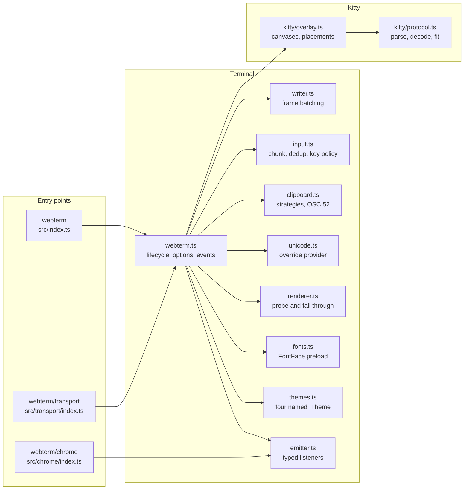

# Architecture

What each module owns, what it depends on, and why the boundaries fall where they do. Every path below is real and links to the file.

## Modules



`src/emitter.ts` is the only file both the terminal and the chrome import, and it is 42 lines of typed listener bookkeeping with no DOM in it. `src/name.ts` is the second shared file: two constants, the UMD global name and the CSS prefix, so renaming the package is a change to two lines plus `package.json`.

The kitty protocol parser ([`src/kitty/protocol.ts`](../src/kitty/protocol.ts)) is deliberately free of any DOM or xterm reference, which is what lets `test/unit/kitty-protocol.test.ts` exercise control-string parsing, RGB expansion, short-buffer fitting and source-rectangle clamping in node with no browser at all. The same split gives `src/unicode.ts` and the strategy half of `src/clipboard.ts` their unit tests.

## Lifecycle

`WebTerm`'s constructor records options and does nothing else. Everything happens in [`open()`](../src/webterm.ts), in this order, and the order is load-bearing at three points:

1. `loadFonts()` awaits every `FontFace` and `document.fonts.ready`. This must finish first. xterm measures the cell box once, during construction, and caches it; a face that resolves later is measured as the fallback forever.
2. `new Terminal(...)` with `allowProposedApi: true`, which both `registerApcHandler` and the unicode provider registry require.
3. `onTerminalCreated(term)` fires here, after construction and before `open`, which is the only window in which a consumer can register a parser handler that sees the first byte.
4. The unicode addon is loaded and the override provider registered.
5. `FitAddon` is loaded, then `term.open(container)`.
6. The renderer addons are installed. This must be after `term.open()`, because they need an element to attach to.
7. The kitty overlay, the image addon (only if `graphics.sixel`), web links (only if `links`).
8. Clipboard, input policy, event wiring, the `ResizeObserver`.
9. The initial sizing: an explicit `cols`/`rows` pair if both were given, otherwise a fit.

`open()` is idempotent through a stored promise: the second call returns the first one's promise rather than opening a second terminal into the container.

`dispose()` runs the teardown list, disposes the overlay, renderer, clipboard, writer and `Terminal`, clears the emitter and empties the container. Every teardown call is individually wrapped, because disposal frequently races xterm's own.

## Where the private access is

One file, [`src/kitty/xterm-adapter.ts`](../src/kitty/xterm-adapter.ts). Nothing else under `src/kitty/` casts through `unknown` to an underscore-prefixed property; the overlay talks to the object that module returns. That is deliberate: an xterm release that renames an internal is one file to read and one file to fix rather than a search across the graphics code. Three dependencies live there, each with its degradation written down beside it.

`term.parser.registerApcHandler` routes the kitty APC. It is absent from @xterm/xterm 6.0.0 and present only in the 6.1.0 beta, so it is also absent from the published types even where it exists at runtime, and it is the reason the package's peer range is `^5.5.0 || >=6.1.0-beta.0`. `supportsApc` reports it up front, so a consumer on a build without it gets a working terminal with no kitty graphics rather than a broken one.

`term._core._renderService.dimensions.css.cell` is the accurate cell box and stays correct through font, size and device pixel ratio changes, but it is not public API. Two public fallbacks sit behind it: `.xterm-screen`'s client size divided by the grid, which is real rather than an estimate, and finally `fontSize * 0.6` by `fontSize * 1.2`, which will misplace images on a font whose metrics differ from that ratio.

`term._core._inputHandler` drives the cursor advance after a placement, and falls back to a queued write that lands a chunk late.

The kitty keyboard protocol needs none of this. `parser.registerCsiHandler`, `attachCustomKeyEventHandler`, `buffer.onBufferChange` and `input` are all published, documented API, so there is nothing there to isolate or to break.

There is a second, milder reach in [`installUnicodeOverrides()`](../src/unicode.ts): it patches `register` on the prototype of xterm's `UnicodeApi` for the duration of `loadAddon`, so it can capture the provider instance the addon registers without reading the addon's private fields. The patch is restored in a `finally`. It has to go on the prototype rather than an instance because `Terminal.unicode` is a getter that constructs a fresh `UnicodeApi` on every access, so the object the addon registers through is never the one read afterwards.

## The outbound path

Everything the terminal sends to the application funnels through one private method, `emitData`:

```ts
private emitData(bytes: Uint8Array): void {
  for (const chunk of chunkBytes(bytes, this.options.input?.chunkBytes ?? DEFAULT_CHUNK_BYTES)) {
    this.emitter.emit('data', chunk);
    void this.transport?.send(chunk);
  }
}
```

Keystrokes (`term.onData`), injected input (`input()`, which goes through `term.input(data, true)` and comes back out of `onData`), pastes and kitty capability replies all arrive here. That is the property the design depends on: a consumer who wires a socket by hand and one who calls `attach()` observe exactly the same bytes in the same chunking, so a bug can never be in only one of the two paths.

Mouse and other binary reports take the parallel `term.onBinary` route, because xterm hands those back as a string of char codes 0-255 rather than text. `MotionFilter` sits there and drops an SGR motion report whose column, row and button all match the previous one.

`input.readOnly` gates both, and nothing else. Output still renders; only the outbound direction goes quiet, including kitty probe replies.

## Fitting

`fit: true` (the default) installs a `ResizeObserver` on the container plus a `window` resize listener, both debounced to 50 ms into a single `fitAddon.fit()`. `fit()` swallows the exception `FitAddon` throws when the container has no layout yet, which is what happens while it is still hidden; the next observation retries.

`resize(cols, rows)` sets `autoFit = false` and resizes explicitly. That is a one-way switch for the life of the instance: `fit()` refits once but does not turn automatic fitting back on. If you need both, call `fit()` yourself from your own resize handling.

## Two builds, three entry points

[`tsup.config.ts`](../tsup.config.ts) emits three configurations:

- The library build: ESM, three entry points (`index`, `transport/index`, `chrome/index`), declarations, source maps, `@xterm/*` external and code-split. This is what a bundler consumer gets, and it is why the addons stay dynamic imports.
- The standalone terminal: IIFE, global `WebTerm`, minified, `@xterm/*` inlined. An IIFE cannot code-split, so every dynamic import is inlined into it, including the image addon the default options never load.
- The standalone chrome: IIFE, global `WebTermChrome`, minified. It has no xterm in it at all, which is only possible because `src/chrome/` imports nothing from the terminal.

`dist` is emptied by the `prebuild` script rather than by either config's `clean`, because the three builds run concurrently and a clean in one would race the output of the others. The CSS files are copied in the first build's `onSuccess`.
